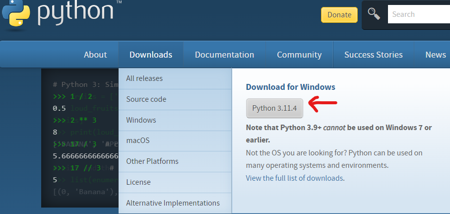
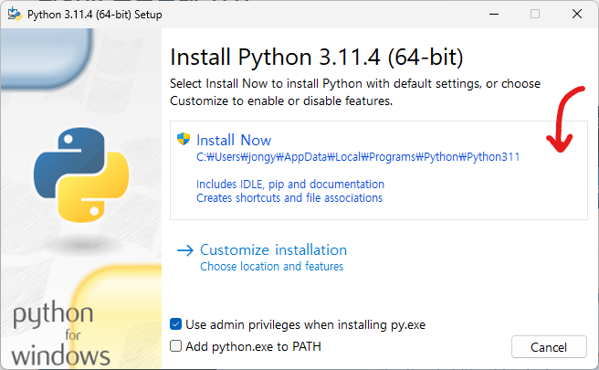
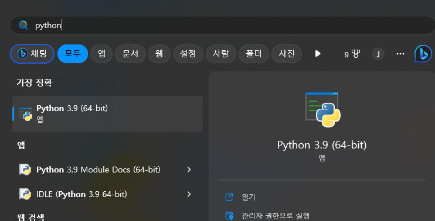

# 시작


- #### **코딩**(`coding`)이란 컴퓨터 프로그램을 작성하는 것으로 **프로그래밍**과 같은 말이다.

- #### **파이썬**(`python`)은 코딩을 하기위한 프로그래밍 언어(`programming lanuguage`)의 일종이다.

- #### **프로그램**은 프로그래밍 언어에서 정한 **명령어**(예약어)를 사용해서 작성한 문서이다.

::: tip
- 한국어, 영어, 중국어와 같은 언어들이 존재하는 것과 같이 프로그래밍 언어에도 C, C++, Java(자바), HTML 등의 많은 언어들이 있다.
:::

## 파이썬 프로그램 설치

- 파이썬 공식 사이트 [<Badge type="tip" text="link" vertical="middle"/>](https://www.python.org/)
  - *Downloads* 탭을 클릭해서 파이썬 프로그램을 다운 받는다.



-----------

- 다운 받은 파일을 실행하면 아래 창이 실행된다.



- **`Install Now`** 를 **클릭**한다.


## 설치 확인하기
- 윈도우 시작을 클릭해서 `python`을 검색한다.



- **IDLE** 를 실행해서 확인한다.

---------------------------

## 실습

- **`hello.py`** 파일을 생성

``` python 
name = input('이름을 입럭하세요')
print(f'안녕? {name}님. 반갑습니다.')
```
- 위 코드를 작성하고 저장한후, 실행 시켜 봅시다.
